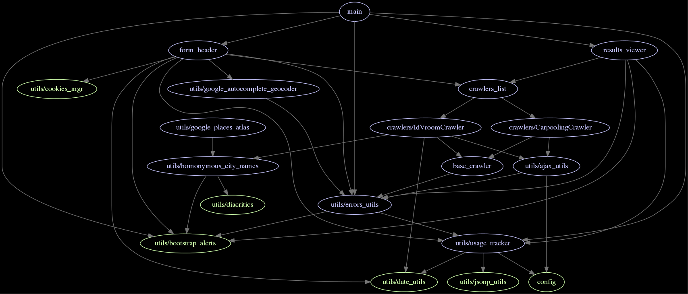

A web search engine for French carpooling ads.

:warning: This project is currently on hold and not actively maintained.

## Live instance

[https://chezsoi.org/ecovoit](//chezsoi.org/ecovoit)

## Runtime dependencies
- [Python Requests](http://python-requests.org/) : for the WSGI proxy script
- [Lo-Dash](//lodash.com) : a functional programming Javascript utility library
- [Twitter Bootstrap](http://getbootstrap.com) : front-end framework for HTML & CSS
- [Bootstrap-datepicker](//github.com/eternicode/bootstrap-datepicker) & [Bootstrap-table](//github.com/wenzhixin/bootstrap-table) : 2 plugins requiring [jQuery](http://jquery.com)
- [Google Maps Places](//developers.google.com/places/documentation) : for its autocomplete functionality
- [SugarJS](http://sugarjs.com) : for its date parsing module. The file  _sugar-1.4.1\_date\_locale-fr.min.js_ is the 'dev' minimal version of SugarJS Date module + the French locale customized build, minimized using the Clojure compiler.

### Build dependencies
make, browserify, david, madge, piprot, uwsgi

### Static checking dependencies
jshint, pylint, jscs, pep8, bootlint, Nu Markup Checker (v.Nu)

### Tests dependencies
tape, pytest, WebTest

## Architecture

### Overview

Once the user has specified the search parameters, AJAX requests are made to the carpooling websites, and the responses are parsed in Javascript to extract the rides information. Because of the [Same-origin policy](//developer.mozilla.org/en-US/docs/Web/Security/Same-origin_policy), those AJAX requests are proxied, but all the parsing logic is still done on the client side.

### Javascript modules

They are following the [Node.js convention](//github.com/substack/browserify-handbook#node-packaged-modules) and are bundled by [browserify](http://browserify.org).

The following diagram represents their dependencies, except a couple of very common base modules, with only 2 crawlers included. It can been generated by invoking `make deps-graph`.

Beware that this does not reveal all the modules ties. E.g. *form\_header.js* is passed the *results\_viewer.js* module and invokes some of its methods but don't include it directly.

### Crawlers

A crawler is a Javascript module, living in the *crawlers/* source directory, dedicated to scrape a single carpooling website. It must respect its _robotos.txt_.

The crawlers modules share a common API, i.e. a list of properties:
* `.DISPLAY_NAME` _[mandatory]_
* `.TAG_NAME` _[mandatory]_
* `.WEBSITE_URL` _[mandatory]_
* `.NEED_LAT_LNG` _[default:*false*]_
* `.HIDDEN_COLUMNS` _[default:*[]*]_
* `.SORT_NAME` _[default:*'departure\_hour'*]_
* `.SORT_ORDER` _[default:*'asc'*]_

Moreover, each crawler must have a `.CALLBACKS_PIPELINE` array property, consisting of an ordered list of callback functions:
    * each function must accept a `cb_chain` as first argument
    * each callback execution must end with a call to `cb_chain.next(_args, _for, _next, _callback)`
    * the first callback is passed a `user_input` dictionary object as first argument, and then a `lat_lng` object if it defines `NEED_LAT_LNG`
    * the last callback must invoke `cb_chain.next` with 3 arguments: (crawler, rides, query_params)

Finally, each crawler must define a  `.remote_search_links(query_params)` function returning either a single string or a dictionary `{link_name: link_href})`.

#### LeBonCoin.fr specificities

Rides on this website are registered by users in a very <strike>chaotic</strike> free-form way. There are 2 methods to get results: queries based on a {searchtext} and queries base on a {location}. The crawler gather rides from both methods.

By default, LeBonBoin.fr search results do not include the ride date, only the ad publication date. Rarely, the author will include the ride date in its ad short description. Similarly, the information on the ride price & driver are often only displayed on the ad page itself.

Because so much structured information is missing, we use the following algorithm to filter out parasite results:
- if a ride date can be extract, discard the ad in the search results if it contains none of the departure / arrival cities in its description
- if no ride date can be extracted, discard any ad that do not contain both the departure & arrival cities

## Installation

You will need [`npm`](//github.com/npm/npma) and [`pip`](//pip.pypa.io/en/latest/) to install the needed libraries and tools.

Under Cygwin, you'll also need to [`apt-cyg`](//github.com/transcode-open/apt-cyg) `install libcrypt-devel` beforehand.

Then, simply invoke `make install` to install everything from the _requirements.txt_ and _package.json_ files.

### Server install

#### Apache mod_wsgi

Once the server is configured with [`mod_wsgi`](//modwsgi.readthedocs.org), just add the following line to its configuration. Assuming you've allowed Apache to serve the other static files in the project directory, it should just work.

    WSGIScriptAlias /ecovoit/proxy /var/www/ecovoit/proxy.py

#### Nginx + uwsgi

    location /ecovoit/proxy {
        include            uwsgi_params;
        uwsgi_pass         wsgi_proxy;
    
        proxy_redirect     off;
        proxy_set_header   Host $host;
        proxy_set_header   X-Real-IP $remote_addr;
        proxy_set_header   X-Forwarded-For $proxy_add_x_forwarded_for;
        proxy_set_header   X-Forwarded-Host $server_name;
    }

    uwsgi --socket :8080 --daemonize uwsgi.log --static-map /=. --mount /ecovoit/proxy=proxy.py --manage-script-name

##### init script to start uwsgi

    pew new ecovoit -p python2
    make install

    cat << EOF | sudo tee /etc/init/ecovoit.conf
    start on startup
    script
        set -o errexit -o nounset -o xtrace
        cd $PWD
        exec >> upstart-stdout.log
        exec 2>> upstart-stderr.log
        date
        HOME=$HOME pew in ecovoit uwsgi --socket :8080 --static-map /=. --mount /ecovoit/proxy=proxy.py --manage-script-name
    end script
    EOF
    service ecovoit start

## Tests

### Manual execution

    make check # => check-static check-style check-html
    make test-proxy # execute the unit tests for the Python proxy
    make run-testling-tests # generate the Javascript unit tests, and open testling-tests.html in a browser to execute them

To execute Javascript tests selectively, you can pass a regular expression as query string to _testling-tests.html_, e.g. :

    http://localhost:8080/index-tests.html?full-blackbox-test

Note: currently unit tests include integration tests, that is tests requiring an Internet connexion and effectively querying websites.

### Continuous Integration Status

This project uses [**SauceLabs**](//saucelabs.com) to run the tests in several browser at once on every push:

To run the Selenium tests manually, you'll have to launch a selenium server and invoke `py.test` :

    wget selenium-release.storage.googleapis.com/2.44/selenium-server-standalone-2.44.0.jar
    java -jar selenium-server*.jar
    make start-local-server
    py.test -sv --pdb tests/saucelabs_selenium_test.py --website http://localhost:8080 --browser=chrome

To run only the chrome test remotely on SauceLabs:

    py.test -sv tests/saucelabs_selenium_test.py::EcovoitTest_chrome

The SauceLabs credentials are stored in a JSON file named  _.saucelabs\_auth.json_.

To load them in a shell, you can use the wonderful [`jq`](//stedolan.github.io/jq) :

    source <(jq -r 'to_entries|.[]|"export SAUCE_\(.key|ascii_upcase)=\(.value)"' .saucelabs_auth.json )
    # defines SAUCE_USERNAME and SAUCE_ACCESS_KEY from .saucelabs_auth.json

## Logo
Credit goes to the amazing [Laetitia Beschus](http://laetitiabeschus.weebly.com) for the artwork.

## License
Creative Commons Attribution NonCommercial (CC-BY-NC)

Tl;dr plain English version: https://tldrlegal.com/license/creative-commons-attribution-noncommercial-(cc-nc)
